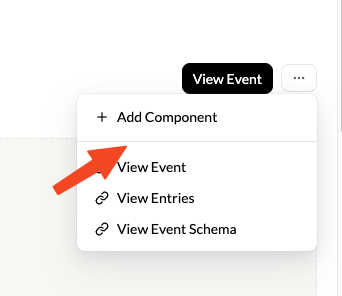
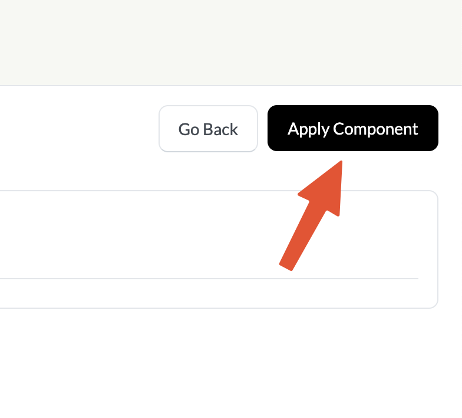

# Components

Components are a simple way to quickly visualize your data.

#### Installation

You can add components to an event directly via the dashboard

On your stream page click the _show more dropdown_ and click **Add Component** __&#x20;

<figure><figcaption></figcaption></figure>

Once you have chosen a component click Preview Component to see a preview of the component you are about to add.

<figure><figcaption></figcaption></figure>

If you're happy with the component hit Apply Component. The component should now be added to your event :tada:

&#x20;

<figure><figcaption></figcaption></figure>
