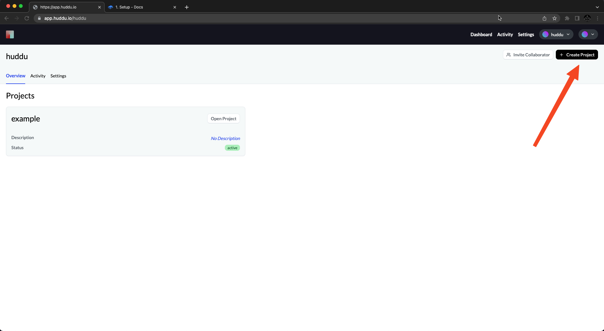
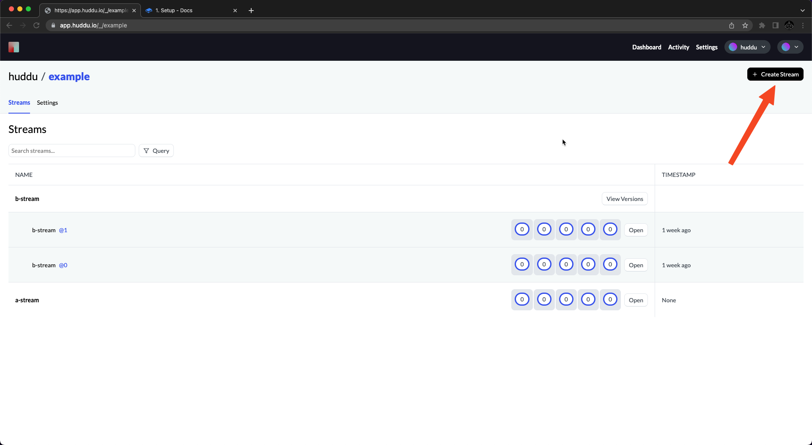
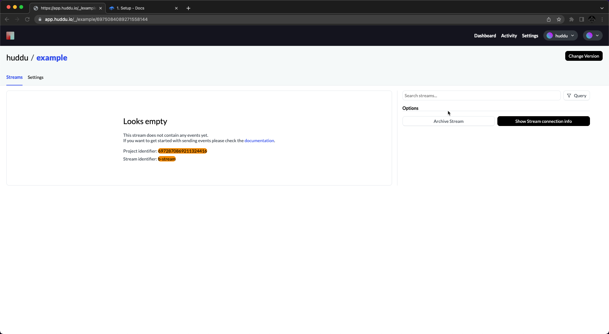

# 1. Setup

In this 3 step guide, you will learn the basics of using the Huddu platform for monitoring your application. So let's get started.

### Creating an account

You can create a free account on the [registration page](https://discord.gg/JFW7dyNXpW).

<figure><figcaption></figcaption></figure>

### Creating a new Project

Once your account is created and verified, you can create a fresh project on the dashboard.

<figure><figcaption></figcaption></figure>

Next, you will be able to choose a name and description for your new project.

### Creating a new Stream

Projects contain streams and streams contain events (which you want to record), so the next step is to create your first stream.

On your projects streams page, create a new stream and give it a name.

<figure><figcaption></figcaption></figure>

When you open your stream it should prompt you with your project identifier and stream identifier. We will need both in the next stream so leave that tab open.

You should see something along the lines of this:&#x20;

<figure><figcaption></figcaption></figure>

In the next part, we will learn how to set up huddu in your code using python.


[2.-code.md](2.-code.md)

