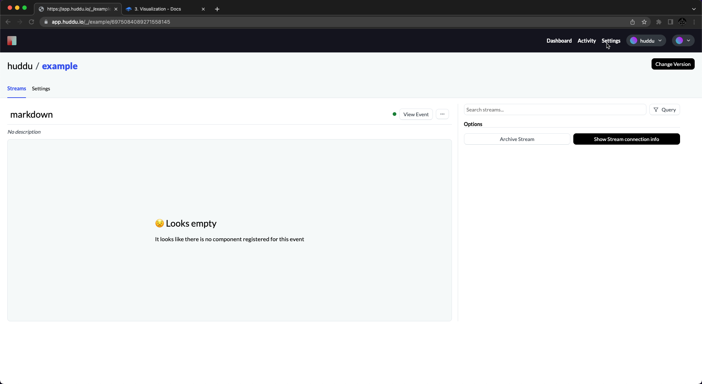
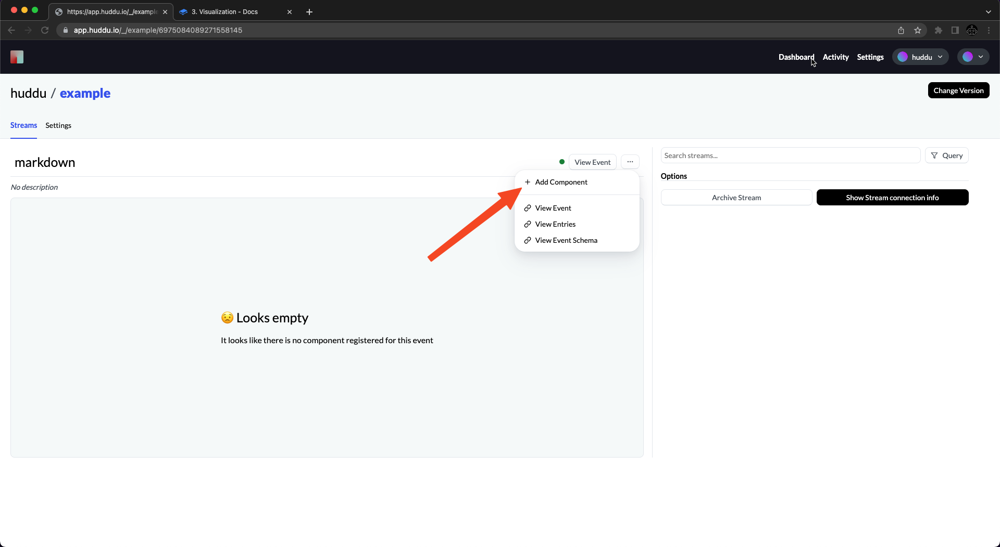
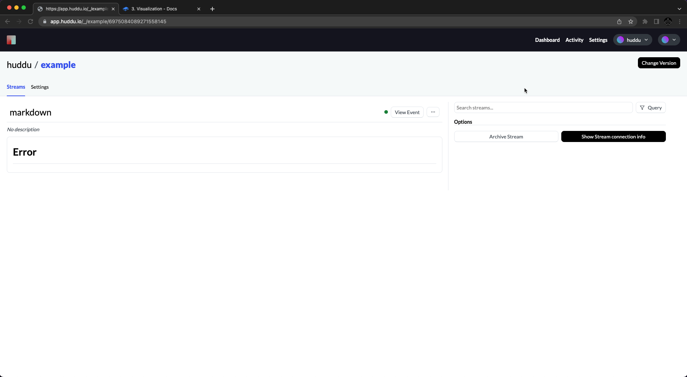

# 3. Visualization

Now that we added some data to our stream it's finally time to visualize our data in a meaningful way.

Your stream page should look something like this now:&#x20;

<figure><figcaption></figcaption></figure>

If you still see a note about the stream not containing any events, don't worry too much. It can take up to two minutes for events to be processed by our system. However, if nothing appears after a while, make sure you didn't receive any errors in the code section of this guide.

Otherwise congratulations  :tada:  you're almost done!

#### Adding a component

After clicking the **add component button** in the dropdown you will be redirected to huddus marketplace where **only components that support your event schema** will be displayed.

<figure><figcaption></figcaption></figure>

For this tutorial, we'll add the huddu/markdown component. Once you're done with the marketplace preview / checkout section you can marvel at your work:

<figure><figcaption></figcaption></figure>

#### So what's next?

* Take a look at the concepts behind huddu [events.md](../concepts/events.md "mention")
* Learn more about the python sdk [python.md](../sdks/python.md "mention")

#### Need additional help? Don't worry!

If you need any further support feel free to ask on our [discord](https://discord.gg/JFW7dyNXpW)!
